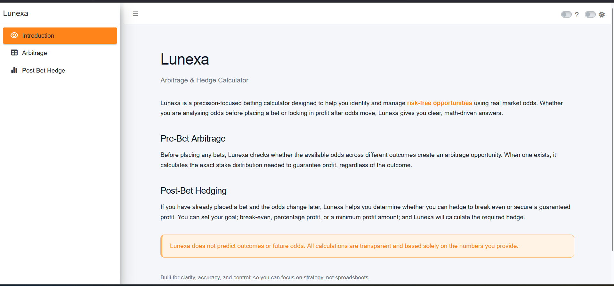
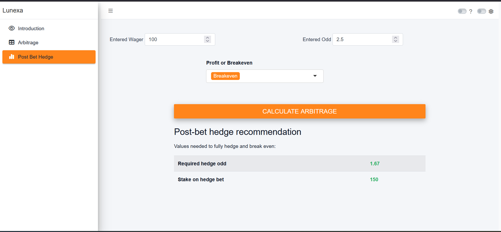

 \# Lunexa \## Arbitrage & Hedge Calculator

# Lunexa
## Arbitrage & Hedge Calculator
Lunexa is a precision-focused betting calculator designed to help you identify and manage risk-free opportunities using real market odds.

Whether you are analyzing odds before placing a bet or locking in profit after odds move, Lunexa provides clear, math-driven answers so you can focus on strategy instead of spreadsheets.

------------------------------------------------------------------------

## Live Application

You can access Lunexa here:

[Open Lunexa](https://sanjayshetty01.shinyapps.io/Lunexa/)

------------------------------------------------------------------------

## Key Features

### Pre-Bet Arbitrage

Before placing any bets, Lunexa checks whether the available odds across different outcomes create an arbitrage opportunity.

When one exists, it calculates the exact stake distribution required to guarantee profit, regardless of the outcome.

------------------------------------------------------------------------

### Post-Bet Hedging

If you have already placed a bet and the odds change later, Lunexa helps you determine whether you can hedge to achieve:

-   Break-even\
-   Percentage profit\
-   Minimum profit amount

You select your target outcome, and Lunexa calculates the required hedge stake accordingly.

------------------------------------------------------------------------

Screenshots

  

------------------------------------------------------------------------

## How It Works

All calculations are transparent and based strictly on the numerical inputs you provide.

Lunexa does not:

-   Predict outcomes\
-   Forecast future odds\
-   Provide betting advice

------------------------------------------------------------------------

## Disclaimer

Lunexa is an analytical calculator for arbitrage and hedge scenarios.\
Users are responsible for their own financial decisions and risk management.
